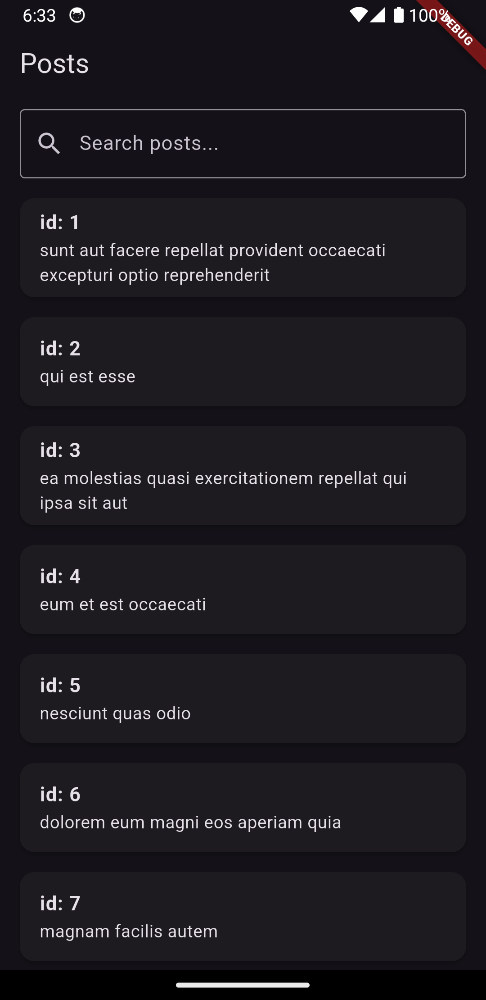
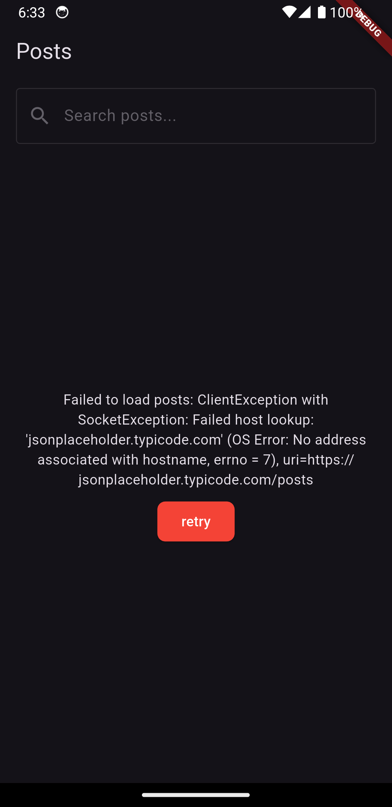

# dev_assignment

A simple fluttter app to exhibit state Management using flutter_bloc and Go_router for navigation.
Support for Android and IOS only.

## Table of contents

1. [Screenshots](#screenshots)
2. [Tech Stack](#tech-stack)
3. [Features](#features)
4. [Development Setup](#development-setup)
5. [License](#license)

- Pending Features : Searching.

## Screenshots

 &nbsp;   &nbsp; 

## Tech Stack

- **[Dart](https://dart.dev/)**: as the programming language.
- **[Flutter](https://flutter.dev/)**: for building cross-platform applications.
-  **[convert](https://pub.dev/packages/convert)**: A package that provides utilities to convert between different types, such as encoding and decoding JSON and other formats.
- **[equatable](https://pub.dev/packages/equatable)**: A package that helps you to make classes easily comparable by overriding the `==` operator and `hashCode`.
- **[flutter_bloc](https://pub.dev/packages/flutter_bloc)**: A package for managing app state using the BLoC (Business Logic Component) pattern with built-in support for Flutter widgets.
- **[go_router](https://pub.dev/packages/go_router)**: A routing package for Flutter that simplifies navigation and deep linking, and enables declarative navigation.
- **[http](https://pub.dev/packages/http)**: A package for making HTTP requests, handling responses, and managing errors while interacting with RESTful APIs.
- **[shared_preference](https://pub.dev/packages/shared_preferences)**: Wraps platform-specific persistent storage for simple data persistence.

## Features

- Calls [jsonPlaceholder: posts](https://jsonplaceholder.typicode.com/posts) and displays it as a list.
- Navigates to a second page with post details.
- Cached data, providing offline support.

## Development Setup

Make sure you have downloaded and set up Flutter and Android Studio correctly before you begin working on this project. Ensure that you have the Flutter SDK installed and the necessary Flutter dependencies are set up. Here is the official Flutter documentation to guide you through the installation and setup process:

- [Flutter Installation](https://flutter.dev/docs/get-started/install)

Additionally, ensure that Android Studio is configured with the Flutter and Dart plugins. This will allow you to develop, build, and test Flutter applications effectively. You can follow the guide below to set up Android Studio for Flutter:

- [Android Studio Setup for Flutter](https://flutter.dev/docs/get-started/editor?tab=androidstudio)

After you are done with the above, you can either download the codebase or import it using your IDE. Wait for it to download all dependencies, then you are ready to run the app.

## License

This project is currently licensed under the Creative Commons Legal Code : CC0 1.0 Universal
